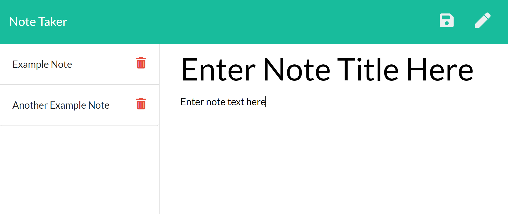

# Notes App  
    
## Description  
  Allows the user to create, save, view, and delete notes   

## Usage  
<ol>
<li>Load the app using the followign link: <a href="/">Notes App (Heroku)</a></li>
<li>Click the "Get Started" button to be taken to the Notes page</li>
<li>To add a note, fill in the note title and text in the corresponding fields on the right half of the page, then click the Save icon in the top right</li>
<li>To view an existing note, click its Title in the list on the left-hand side of the screen</li>
<li>To dismiss the viewed note and return to creating new notes, click the pencil icon in the top right of the page</li>
<li>To delete a note, click the corresponding trash can icon next to the note you wish to delete</li>
</ol>

## Questions  
My GitHub profile: [crichards17](https://github/crichards17)  
My email: [crichards1717@gmail.com](crichards1717@gmail.com)  